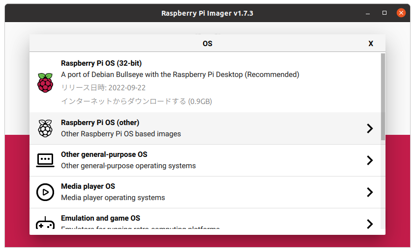
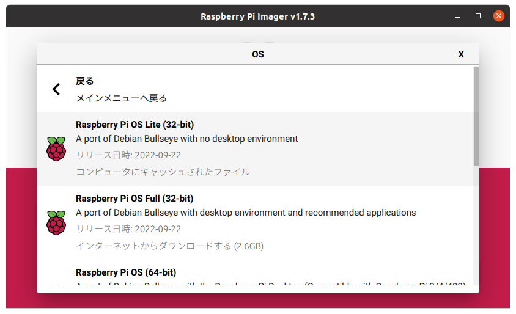

# UNVT Portable インストール方法

以下に掲載されているインストール方法を、Linuxの操作になれていない方向けになるべく簡単にインストールできるようにしたものです。
- https://github.com/unvt/portable/wiki/1.-How-to-install


## 1.事前準備

- Raspberry Pi 400（キーボード付き）にHDMIモニタを接続した状態でインストールすることを前提としています。
- Raspberry Pi 4にインストールする場合は、キーボードとHDMIモニタを接続してください。


## 2.microSDカードにRaspberry Pi OSを書き込む

1. [Raspberry Pi Imager](https://www.raspberrypi.com/software/)のインストーラーをPCにダウンロードし、ダブルクリックしてインストールする。
2. インストールしたRaspberry Pi Imager を起動する。
3. OSのボタンをクリックする。
4. Raspberry Pi OS(other)を選ぶ
    
    
    
5. Raspberry Pi OS Lite (32-bit)を選ぶ
    
    
    
6. 右下の歯車のマークを押す
7. 公式マニュアルの　**[1-1-2.　Change SSH and Wi-Fi settings before installation.](https://github.com/unvt/portable/wiki/1.-How-to-install#1-1-2change-ssh-and-wi-fi-settings-before-installation)**　に従ってオプションを設定する。
8. microSDカードをPCにセットする。
9. 「ストレージを選ぶ」のボタンを押して、microSDカードを選択する。
10. 「書き込む」を押す。
11. 「取り出してください」と表示されたら、microSDカードを取り出す。

## 3.Raspberry Pi 400にログインする

1. OSを書き込んだmicroSDカードをRaspberry Pi 400にセットする。
2. microHDMIコネクタにディスプレイを接続する。（２つコネクタがあるけどどちらでも良い）
3. USB-Cコネクタに電源を接続する。
4. しばらく画面が流れるのでそのままにしておく
5. login: となったら pi と入力する。
6. Password: には unvt と入力する。
7. ログインが完了すると、以下の表示になる。この状態でコマンドの入力ができるようになる。
    
    ```bash
    pi@unvtportable:~ $
    ```
    

## 4.必要なソフトウェアのインストールを行う

1. ログインしている状態で、以下のように入力する。途中パスワードを聞かれたら unvt と入力する。
    
    ```bash
    sudo apt update
    ```
    
2. gitコマンドをインストールする
    
    ```bash
    sudo apt install git -y
    
    ```
    
3. カレントディレクトリを変更する。
    
    ```bash
    cd
    ```
    
4. インストールスクリプトをダウンロードする。
    
    ```bash
    git clone https://github.com/kanpapa/unvt.git
    ```
    
5. インストールスクリプトのディレクトリに移動する。
    
    ```bash
    cd unvt/portable
    ```
    
6. インストールスクリプトを実行する。
    
    ```bash
    bash ./setup.bash
    ```
    
7. インストールと設定が終わると、自動的にRaspberry Pi 400がシャットダウンする。

## 5.WiFiのアクセスポイントの接続確認

1. もう一度Raspberry Pi 400の電源を入れる。
2. スマホでWi-Fiのアクセスポイントを見て、dronebirdというSSIDが見えていることを確認する。
3. このアクセスポイントに接続し、パスワードはdronepass21と入力すると接続される。
4. ブラウザで http://192.168.10.10/ をアクセスすると、Apacheの初期画面が表示される。

## 6.WiFiのパスワードを変更する（必ず行うこと）

1. Raspberry Pi 400にログインする。（ユーザ名はpi、パスワードはunvt）
2. 以下のように入力する
    
    ```bash
    sudo nano /etc/hostapd/hostapd.conf
    ```
    
3. 以下の部分を修正して、上書き保存する。
    
    ```bash
    wpa_passphrase=dronebird
    ```
    
    ※dronebirdがWiFiのパスワードなので適当な英数字列に変更しておくこと。
    
4. 以下のコマンドを入力してRaspberry Pi 400を再起動する。
    
    ```bash
    sudo reboot
    ```
    
5. 以降はWiFi接続時には新しいパスワードを使ってください。

## 7.Webコンテンツを置く

1. Raspberry Pi 400にログインする。（ユーザ名はpi、パスワードはunvt）
2. 以下のようにコマンドを入力する。（公式マニュアルの**[1-8-1.](https://github.com/unvt/portable/wiki/1.-How-to-install#1-8-1temporarily-change-permission-on-varwww-to-777)**の作業）
    
    ```bash
    cd /var/www
    ```
    
3. 以下のようにコマンドを入力してファイルの操作権限を設定します。
    
    ```bash
    sudo chmod 777 —R .
    ```
    
4. ファイルの権限が正しいか確認する。
    
    ```bash
    ls -al
    ```
    
5. 以下のように表示されれば問題ありません。
    
    ```
    pi@unvtportable:/var/www $ ls -al
    total 12
    drwxrwxrwx  3 root root 4096 Jan 15 10:16 .
    drwxr-xr-x 12 root root 4096 Jan 15 10:16 ..
    drwxrwxrwx  2 root root 4096 Jan 15 10:16 html
    ```
    
6. この後は公式マニュアルの **[1-8-2.　SFTP data transfer with Cyberduck](https://github.com/unvt/portable/wiki/1.-How-to-install#1-8-2sftp-data-transfer-with-cyberduck)** のようにsftpでコンテンツをRaspberry Pi 400に転送する。（ここに何を転送するのかはまだ不明。）

## 8.Raspberry Pi 400の電源を切るとき

1. Raspberry Pi 400にログインする。（ユーザ名はpi、パスワードはunvt）
2. 以下のコマンドを入力する。
    
    ```bash
    sudo shutdown -h now
    ```
